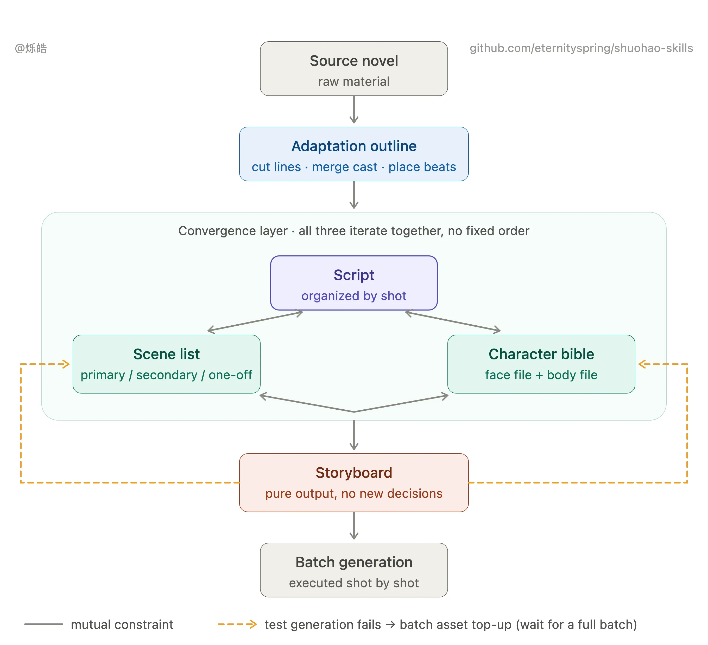

[中文](README.md) · **English**

> 👋 **Open to work / collaboration** — I'm between jobs right now, and this repo is what I build in that spare time.
> Happy to hear from anyone this resonates with. Besides **remote work**, I'm also open to a **half-collaboration**: a few thousand RMB a month for living costs plus a profit share. On-site trips are possible where the work genuinely needs them. What I'm really after is finding people on the same wavelength to build something in this AI wave.
> Email: **[eternityspring@gmail.com](mailto:eternityspring@gmail.com)** · Résumé: **[resume.79px.com](https://resume.79px.com)** · WeChat **`hao_dev`** (please mention `github` when you add me)
>
> These skills are free and open source, built and battle-tested on real AI short-drama production.
> If they save you an afternoon, consider [**buying me a coffee on Ko-fi**](https://ko-fi.com/eternityspring) ☕ — it keeps the updates coming.

# shuohao-skills

**Agent skills for AI short-drama production** — from a novel to shoot-ready material: character bibles, adaptation outlines, scene & prop bibles, screenplays, storyboards. Built for AI coding agents, **runs in both Claude Code and codex**.

Here is the whole pipeline — **the outline converges the structure; script, scenes and characters iterate together; the storyboard only outputs, it makes no new decisions**:



| Skill | What it does |
| --- | --- |
| [**novel-outline**](skills/novel-outline/README.en.md) | Adapts a novel into a five-piece short-drama outline: adaptation notes, cast, beats, per-episode synopses, asset list (including a narrative-prop table). All 14 quality gates are script-checked; includes a checkup mode for existing outlines |
| [**novel-characters**](skills/novel-characters/README.en.md) | Turns the cast the outline settled on into a character bible: profiles, design prompts, voice prompts, model sheets. Seeds the roster from outline.json; report language and image style are both configurable |
| [**novel-art**](skills/novel-art/README.en.md) | Art bibles for AI production (scenes + narrative props): consistency anchors, lighting & state variants, scale references, no-people/no-hands white plates. Seeds from outline.json; all 11 quality gates script-checked |
| [**novel-script**](skills/novel-script/README.en.md) | Screenwriting for AI short drama: scenes + beat flow (action beats alternating with dialogue lines), per-episode duration deterministically estimated from reading speed, a gated cold-open hook in the first 3 beats, a per-character line book with voice prompts that feeds straight into TTS. All 10 quality gates script-checked |
| [**novel-storyboard**](skills/novel-storyboard/README.en.md) | Storyboarding for AI short drama: segments (one generation, ≤15s) → cuts (2–5s hard gate) → keyframes (master pinned at 0.00s, sub-frames at their cut marks), with MiniMax H3 prompt alignment and cut times audited verbatim; frames actually generated with the design sheets as references, plus one-command H3 production packs. All 17 quality gates script-checked (the 17th audits shot-recipes cards when the library is mounted) |

Off to the side of the pipeline there is a **shot vocabulary library** that none of the five skills is required to mount:

| Skill | What it does |
| --- | --- |
| [**shot-recipes**](skills/shot-recipes/README.en.md) | A shot vocabulary library for generative AI video — 67 cards in two families: **recipe cards** (17) answer "how should this cut in this scene be taken", **technique cards** (50) answer "what this device is, when to use it, and **when not to**" across camera move, angle, shot size, composition, lens & depth, lighting and special technique. **All 20 official H3 camera terms are covered, and completeness itself is a gate** — `lint` names any domain item nobody wrote. **Useful well beyond short drama** (product promos, explainers, vlogs). Every card declares must-have phrases that can be machine-audited; `novel-storyboard` can optionally mount the library with `--shots` |

**Every skill renders its report in English too** — reports default to a Chinese UI; pass `--lang en` to `render` for a fully English report (data content stays as authored).

Point it at a novel and you get all five:

**novel-outline · short-drama adaptation outline**


**novel-characters · character bible**


**novel-art · art bible (scenes + props, sheets actually generated by the skill)**


**novel-script · screenplay (duration gauge + episode scripts + line book)**


**novel-storyboard · storyboard (cut rhythm strip + master/sub keyframes actually generated by the skill + H3 prompts)**


And off the pipeline, the shot recipe gallery — **an empty cell in the category × energy matrix is a vocabulary gap**:

**shot-recipes · shot recipe library (category × energy matrix + card wall, example frames actually generated by the skill)**


## Install

```bash
git clone https://github.com/eternityspring/shuohao-skills.git
cd shuohao-skills
./scripts/install.sh
```

It detects whether you have Claude Code or codex installed and **symlinks** every skill into place — so `git pull` takes effect immediately, with no reinstall.

```bash
./scripts/install.sh novel-characters   # just one skill
./scripts/install.sh --codex            # only into codex
./scripts/install.sh --uninstall        # remove the symlinks
```

Prefer to do it by hand:

```bash
ln -s "$PWD/skills/novel-characters" ~/.claude/skills/novel-characters
ln -s "$PWD/skills/novel-characters" ~/.codex/skills/novel-characters
```

## Requirements

| | Required? | Notes |
| --- | --- | --- |
| **Node** | Yes | ≥ 18. The skill scripts use only the standard library — **no npm dependencies, nothing to install** |
| **Model quota** | Yes | Uses your current session's quota. **No API key needed** |
| **codex CLI** | Optional | Only for image generation (via its built-in `$imagegen`). Without it, image steps are skipped and everything else still runs |

> **Note on output language.** These skills are Chinese-first. `novel-characters` produces Chinese character profiles even for an English source novel, and its validator actively rejects English in those fields. See that skill's README for what it would take to change.

## Repository conventions

One directory per skill, **self-contained and copyable on its own**:

```
skills/<skill-name>/
├── SKILL.md          the workflow the agent reads (required)
├── README.md         the docs a human reads
├── scripts/
│   ├── <name>.mjs    deterministic helpers, zero dependencies
│   └── selftest.mjs  self-test, never calls a model (required)
├── references/       detailed instructions, loaded on demand
├── examples/         bundled samples that double as test fixtures
└── assets/           screenshots
```

Two hard requirements:

- Every skill must have a `SKILL.md`
- Every skill must have a `scripts/selftest.mjs` that **calls no model and costs no quota**, covering all deterministic logic

Run every self-test before adding a skill:

```bash
for f in skills/*/scripts/selftest.mjs; do node "$f"; done
```

There is no CI — the self-tests run in about a second, so running them locally beats waiting on a pipeline. **Only tested on macOS with Node 24**; there is no platform-specific code, so Linux and older Node releases should be fine, but that is unverified.


## License

[Apache 2.0](LICENSE)
