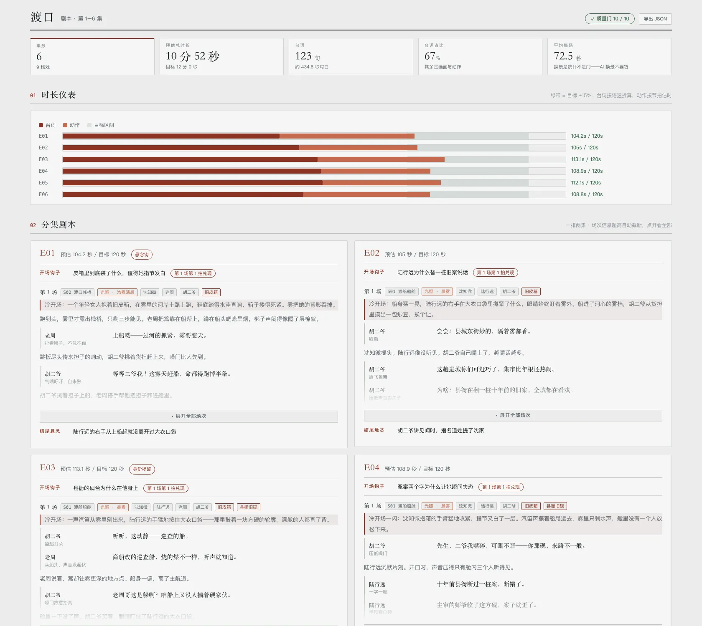

[中文](README.md) · **English**

# novel-script

Screenwriting for AI short drama: turns novel-outline's per-episode synopses into scenes and dialogue. The premise is baked in: **the script owns the drama, the storyboard owns the filming.** "Is it gripping" and "how to shoot it" iterate at completely different speeds — dialogue gets rewritten constantly, and binding it to shot breakdowns means re-cutting shots on every line change. So this layer has no shot numbers and no frame prompts; those belong to the storyboard skill one layer down.

One line is held firmly though: **dialogue is structured data, not prose.**

- **Beat flow** — every scene is an alternating sequence of action beats and dialogue lines: one event per action beat (narrative prose), every line carrying its speaker and delivery note. Lines feed straight into per-line TTS; action beats are what the picture has to do
- **Per-episode time budget** — dialogue converts at reading speed (4.5 chars/sec by default), action at a fixed per-beat estimate (2.5s). Every episode must land within ±15% of target. **A three-minute episode is three minutes** — overruns are caught here, not in the generation pipeline
- **Hook + cliffhanger** — on paper for every episode, and **the hook is the first beat, not a label**: `hookBeat` claims its concrete image, gated to the episode's first 3 beats (cold open); beats promised by the outline must be claimed by actual scenes
- **Voice-over convention** — `VO` marks inner voice and narration, whose voice goes in the delivery note; the line book groups VO separately

Outputs `script.json`, a Markdown script, and a self-contained `script-report.html`:



## Ten quality gates, all code

Same stance as the other three skills in this repo: **a checklist the model grades itself on is worthless.**

| Gate | Rule |
| --- | --- |
| **Episode duration** | estimate within ±15% of `targetSeconds` (speed, per-beat seconds and tolerance all tunable via `params`) |
| Line length | ≤ 35 chars — a line you can't say in one breath can't be generated either |
| Speaker legality | speaker must be in the scene's cast, or explicitly `VO` |
| Hook & cliff on paper | `hook` / `cliff` required per episode |
| **Hook lands in the first 3 beats** | `hookBeat` claims where the hook's concrete image appears — the cold open is a gate, not a habit, so the hook and the actual opening can never drift apart |
| **At least one action beat per scene** | a dialogue-only scene is radio drama — nothing for the picture to do |
| Narrative action | no quoted dialogue inside action beats — lines only live in dialogue entries |
| Beats claimed | every beat the outline pins to this episode must be claimed (checked with `--outline`; skipping is **announced**, never silent) |
| Character refs | scene casts must exist in the outline (with `--outline`) |
| Scene refs | scene exists, **lighting state is registered in the art bible**, props exist (with `--art`) |

The selftest **defeats every gate on purpose** to prove each one actually blocks.

## The report

**Reports render with a Chinese UI by default; pass `--lang en` for a fully English report** (or set a top-level `"lang": "en"` in script.json — `--lang` wins when both are given). In English mode the quality-gate labels are translated too (thresholds kept as computed); failing-gate details and all data stay as authored.

A single-page, 1600px-wide review document:

- **KPI band**: episodes / estimated total vs target / line count / dialogue ratio / average scene length — scene changes are a statistic, not a gate; AI scene changes are free
- **Duration gauge**: one bar per episode, dialogue and action stacked, laid over the target-range band; overruns and shortfalls called out in red with exact seconds
- **The script itself**: the main body, **two episodes per row**. Episode header (estimate / hook / cliff / claimed beats) always visible; the scene area clips at 300px with a fade and toggles open per episode; per-line copy buttons on hover
- **Scene table**: every scene × setting × lighting × cast × estimated seconds — computed, never hand-written
- **Line book**: **two blocks per row**, all dialogue grouped by character, each list six rows tall with its own scrollbar, with episode/scene references and a copy-all button; with `--cast`, each character header also carries a **voice-prompt** copy button — lines and voice design on one page, straight into TTS
- **Quality gates** panel + header badge + **Export JSON** (downloads `script.json` verbatim — edit and feed it straight back into `render` / `validate`)
- All graphics inline CSS/SVG, zero external resources, opens offline

## The relay

```
novel-outline    → outline.json (what)
novel-characters → cast.json    (who)
novel-art        → art.json     (where + what's in their hands)
novel-script     → script.json  (the drama: scenes, beats, lines)
```

`seed <outline.json> --eps 1-3` deterministically prefills each episode's skeleton (target seconds, hook, cliff, claimed beats, candidate scenes and cast). `validate --outline --art` cross-checks characters, beats, and scenes/lighting/props — a lighting state the art bible never registered fails right here. `render --outline --art` displays names instead of raw IDs: **IDs in the data, names on screen.**

One layer down comes the storyboard skill: shot numbers, per-shot duration, first-frame prompts, generation batching.

## CLI

```bash
node scripts/novel-script.mjs seed outline.json --eps 1-3
node scripts/novel-script.mjs validate script.json --outline outline.json --art art.json
node scripts/novel-script.mjs checkup script.json
node scripts/novel-script.mjs render script.json --html --outline outline.json --art art.json --cast cast.json > script-report.html
node scripts/novel-script.mjs render script.json --html --lang en --outline outline.json --art art.json > script-report.html
```

The report UI defaults to Chinese; `--lang en` renders it fully in English.

## Limits

- No shots, no shot numbers, no generation prompts, no images — nothing from the storyboard layer
- Duration is an **estimate, not a stopwatch** — that's what the ±15% tolerance is for; tune `params.charsPerSecond` to your voice-over pace
- Report UI ships in Chinese and English (`--lang zh|en`, Chinese by default, or the script.json top-level `lang` field); dialogue follows the drama's language
- Write ≤ 3 episodes per batch — the script is the most-rewritten layer of the whole pipeline

## Selftest

```bash
node scripts/selftest.mjs
```

154 assertions — timing engine, stats, gate-defeating cases, seed, rendering (both UI languages), export. No model calls, runs in about a second.

The bundled example (`examples/渡口-script.json`) is a **complete 6-episode script** — 9 scenes, 123 lines, every episode inside the ±15% band, all gates passing against the outline and art fixtures.

**Only tested on macOS + Node 24.**
