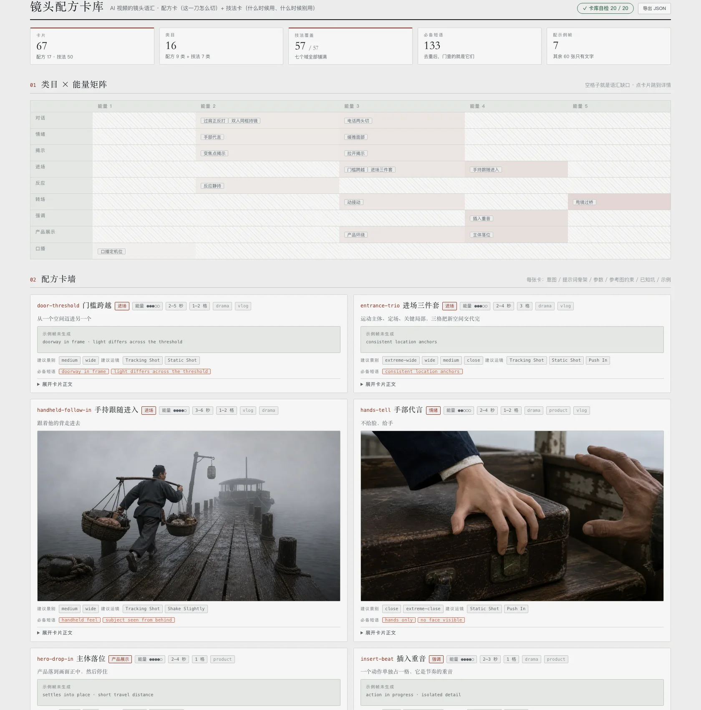

**中文** · [English](README.en.md)

# shot-recipes

**AI 生成式视频的镜头语汇卡库。** 前提刻在骨子里：这是生成式视频（MiniMax H3 / 可灵）不是程序化渲染——同一个位置，程序化那边写帧数与缓动曲线，我们写**提示词怎么写、参考图怎么挂、切几格、AI 会在哪崩**。

它补的是中间那层空缺：

| 层 | 谁在管 | 问题 |
| --- | --- | --- |
| 词汇层 | 景别枚举 + H3 官方运镜词 | 原子词，不是配方——模型自由组合，没有「这一刀该怎么切」的知识 |
| **配方层 + 技法层** | **这个 skill** | **命名的镜头语汇：意图 / 适用场景 + 提示词骨架 + 参数 + 已知坑，还能被机器复核** |
| 手感层 | 切镜手册里的经验条 | 口头经验，用没用、用对没用无从检查 |

## 两族卡

| 族 | 回答什么问题 | 类目 | 数量 |
| --- | --- | --- | --- |
| **配方卡** | **这场戏这一刀该怎么切** | 对话 / 情绪 / 揭示 / 进场 / 反应 / 转场 / 强调 / 产品展示 / 口播 | 17 张（7 张配示例帧） |
| **技法卡** | **这个手段是什么、什么时候用、什么时候别用** | 运镜 / 机位角度 / 景别 / 构图 / 焦段与景深 / 光线 / 特殊技巧 | 50 张 |

中英双版 · **短剧之外也能用**（产品宣传、口播、Vlog）。

**两族不合成一族的理由**：合了之后类目就同时在说两件事（功能与手段），画廊那张类目 × 能量矩阵立刻失去意义。两族各画各的图。

## 完整性是门，不是口号

技法卡最怕的是「看着挺全，其实缺一半」。所以每个技法类目都定了一个**域**，每张卡用 `covers` 认领它讲掉的那几项，**域里少一项 `lint` 就点名**：

| 类目 | 域 | 项数 |
| --- | --- | --- |
| 运镜 | **20 个 H3 官方运镜词，一个不少** | 20 |
| 机位角度 | 平视 / 低角度 / 高角度 / 顶视俯拍 / 贴地仰拍 / 荷兰角 / 过肩 | 7 |
| 景别 | 大远景 / 全景 / 中景 / 近景 / 大特写 | 5 |
| 构图 | 三分 / 中心 / 框中框 / 前景遮挡 / 对称 / 留白 / 引导线 | 7 |
| 焦段与景深 | 广角 / 标准 / 长焦压缩 / 浅景深 / 深焦 | 5 |
| 光线 | 逆光剪影 / 侧光 / 顶光 / 底光 / 实用光源 / 高调 / 低调 | 7 |
| 特殊技巧 | 希区柯克变焦 / 一镜到底 / 慢动作 / 定格 / 延时 / 跳切 | 6 |

**「这个库覆盖全了运镜」从此是查出来的，不是谁说的。** 画廊里那张覆盖表把域逐项摊开，灰掉的就是还没有人讲的那一项。



## 一张卡长什么样

frontmatter 是机器字段，正文六节固定，两族各一套：

```
配方卡                          技法卡
## 意图                         ## 这是什么       和最容易混淆的那个划清界限
## 提示词骨架                    ## 适用场景   ★  哪种戏 / 哪个位置 / 什么情绪 + 什么时候别用
## 参数表                        ## 提示词怎么写
## 参考图约束                    ## 参数表
## 已知坑                        ## 已知坑
## 示例                          ## 示例
```

**参数表的「调节手感」列是这张表的价值所在**——只写默认值等于没写，要写「往上调会怎样、往下调会怎样、超过哪里就翻车」。

**技法卡的「适用场景」必须写「什么时候别用」，这是门**。只写什么时候用，读卡的人一定会滥用它，所以那一段的标记 `lint` 逐字查，缺了直接红。技法卡把这一节排在提示词前面也是同一个理由：**手段本身没有「什么时候用」就是废知识**。

## 必备短语：全库唯一被机器强制的东西

每张卡声明 ≤3 条必备短语，它们是**这张配方每一格都为真**的英文短语。挂在分镜上之后，机器逐格检查它们有没有真的写进提示词。

六条硬约束（`lint` 逐条拦）：

| 约束 | 为什么 |
| --- | --- |
| ≤ 3 条 | 短语越多挂配方越贵，贵到一定程度就没有人挂——可选的东西一旦变贵等于不存在 |
| 全小写 | 判定时两边小写化，避免大小写造成的假失败 |
| 含空格或连字符、长度 ≥ 6 | 单个通用词会被当子串误判：`wide` 是 `extreme wide shot` 的子串，写它的卡在大远景上会假通过 |
| **不许撞 20 个 H3 运镜词与 5 个景别短语** | 那两类各自已经有一道门在管，而且查的位置不同（一个查 `[Shot k]` 段落、一个查 `frame`）——同一个词两处判定，极易一边过一边不过 |
| **必须原样单行出现在本卡的提示词骨架里** | 骨架是给人照抄的，抄下来必须能直接过 `check`。为了排版把短语拆到两行，肉眼看得见、机器判不出来——真踩过 |
| **必须配一条中文释义**（`must_phrases_zh`） | 短语本身不能翻译——它要被原样复制进提示词，改一个字母门就不认了；但一整张索引表全是英文，中文读者没法用。所以释义单独一列，一一对应，**同一条短语在不同卡上的译法必须逐字相同** |

第 4 条推出这个库的存在理由：**配方只描述官方词表描述不了的东西**——前景肩、浅景深、手持质感、材质轮廓、光比差。

## 命令行

```bash
node scripts/shot-recipes.mjs list                     # 索引表（两族都列）
node scripts/shot-recipes.mjs list --kind technique     # 只看技法卡
node scripts/shot-recipes.mjs list --kind recipe        # 只看配方卡
node scripts/shot-recipes.mjs list --for product       # 按题材筛（drama/product/talking-head/vlog）
node scripts/shot-recipes.mjs list --category camera-move # 按类目筛
node scripts/shot-recipes.mjs search 正反打             # 搜卡，正文也搜
node scripts/shot-recipes.mjs show ots-shot-reverse     # 打印整张卡（--lang en 出英文）
node scripts/shot-recipes.mjs lint                      # 卡库自检
node scripts/shot-recipes.mjs check <storyboard.json>   # 检查分镜里的配方引用
node scripts/shot-recipes.mjs render --html > references/cards/gallery.html          # 画廊报告
node scripts/shot-recipes.mjs render --html --lang en > references/cards/gallery.html # 英文界面
```

报告要写进 `references/cards/`——示例帧走相对路径 `frames/…`，写到别处图就不显示了。

## 画廊报告

单页、零外部依赖、双击就能开，与仓库另外五份报告同一套视觉语言：

- **类目 × 能量矩阵**（招牌图，配方卡）：9 行类目 × 5 列能量，**空格子就是语汇缺口**——库缺什么一眼看见，后续加卡有方向
- **配方卡墙**：两列，每张卡带 chips（类目 / 能量 / 秒数 / 格数 / 题材）、示例帧（点击放大，没有就显示占位不装有）、**必备短语点击即复制**、正文六节折叠
- **技法覆盖表**：七个类目的域逐项摊开，**灰掉画斜纹的就是还没有人讲的那一项**，悬停看是哪张卡讲的。右边一列 `20 / 20` 这样的分数，缺一项就变红
- **技法卡墙**：同配方卡墙，卡头多一排 `covers` chips——这张卡认领了域里的哪几项
- **必备短语索引**：短语 → **中文释义** → 声明它的卡 → 次数，撞车一眼可见。短语列永远是英文原文（要原样抄走），释义列只在中文界面出现
- KPI 带：卡片 67（配方 17 · 技法 50）/ 类目 16 / **技法覆盖 57 / 57** / 必备短语 133 / 配示例帧 7
- **覆盖对照**（给了 `--check` 才出）：每张卡被使用几次，**以及从没被使用的卡**——不装繁荣
- 导出 JSON：下载整份卡库快照（机器字段 + 分节正文）

## 它是自包含的，可以整个拷走

这个目录**不依赖任何别的 skill**：卡片正文不引用外部文档，`references/` 里的出图契约、写卡纪律、报告约定全是自带的一份，脚本零依赖只用 Node 标准库。**整个 `shot-recipes/` 目录拷到别的仓库就能用。**

- 展示数据是自己的：`examples/vocab-reel.json` —— **《回信》**，1995 年北方小城，一个故事串起全部镜头语汇，**2 个人物 / 3 个空间 / 3 件道具 / 36 格**。示例帧也全部照这份样片出——**不借用任何别的 skill 的样例**
- 卡片里说的「角色设定图 / 场景设定图」是通用概念，指你自己手上的那几张图，不绑定任何产图工具
- 20 个运镜词与 5 个景别短语是**本库自带的一份常量**，注明来源，不跨目录 import

下面这一节讲的是与同仓库 `novel-storyboard` 的可选集成——**不用它照样跑**。

## 给分镜挂上（可选）

分镜的 cut 上写 `"recipe": "<卡片 id>"`，然后：

```bash
node scripts/shot-recipes.mjs check <storyboard.json>
```

`check` 深度遍历任意 JSON，收集**同时带 `recipe` 与 `frame` 的对象**，JSON 路径当定位符——所以它吃任何分镜结构。遇到中文提示词跳过并计数，不静默也不误报一片。

同仓库的 `novel-storyboard` 也可以通过 `--shots <这个目录>/references/cards` 可选挂载同一套卡库，不给就明说跳过。两个 skill 各自独立，谁没有谁都能跑。

## 双语的组织

**机器字段只有一份**（`cards/<id>.md` 的 frontmatter，语言中立），正文分语言：中文在同一个文件里，英文在 `cards/en/<id>.md`。`--lang en` 时正文取英文，缺了回落中文并明标——门永远只读一份机器字段，不存在双语漂移。

## 加新卡

```bash
node scripts/shot-recipes.mjs lint
```

格式要求见 `references/card-schema.md`，写卡纪律见 `references/card-pass.md`。**门槛不在格式上**：`## 示例` 节必须举得出一个真实做过的分镜片段或真的生成过的示例帧——举不出来的不是配方，是想法。

## 文件

```
SKILL.md                 给 agent 读的工作流
scripts/
  shot-recipes.mjs       list / show / search / lint / check / render
  selftest.mjs           244 项断言，不调模型，lint 每条规则都有击穿用例
references/
  cards/<id>.md          卡片（frontmatter + 中文正文）
  cards/en/<id>.md       英文正文
  cards/frames/          示例帧
  card-schema.md         字段结构 + 不变量 + 扩展契约
  card-pass.md           写卡纪律：硬规则 / 手感 / 常见病
  frame.md               示例帧出图的 codex 契约
  report-style.md        画廊报告的设计约定
examples/
  mini-storyboard.json   check 的夹具（一处合规 + 三处击穿）
assets/report.webp       画廊截图
```

## 来源说明

卡片的**格式**（一句话 / 适用 / 意图 / 参数表带「调节手感」列 / 已知坑）学自开源项目 [video-shotcraft](https://github.com/Vincentwei1021/video-shotcraft)（Remotion 程序化渲染方向）。**内容全部是本仓库自己的生成式实践**：它的参数是帧数与缓动曲线，我们的参数是秒数、格数、虚化强度与参考图挂载。方法论已内化在本 skill 自带的 references 里，**不依赖任何外部 skill**。

**只在 macOS + Node 24 上实测过。** 代码没有平台相关调用，Linux 和更低版本 Node 理论上没问题，但**没验过**。
