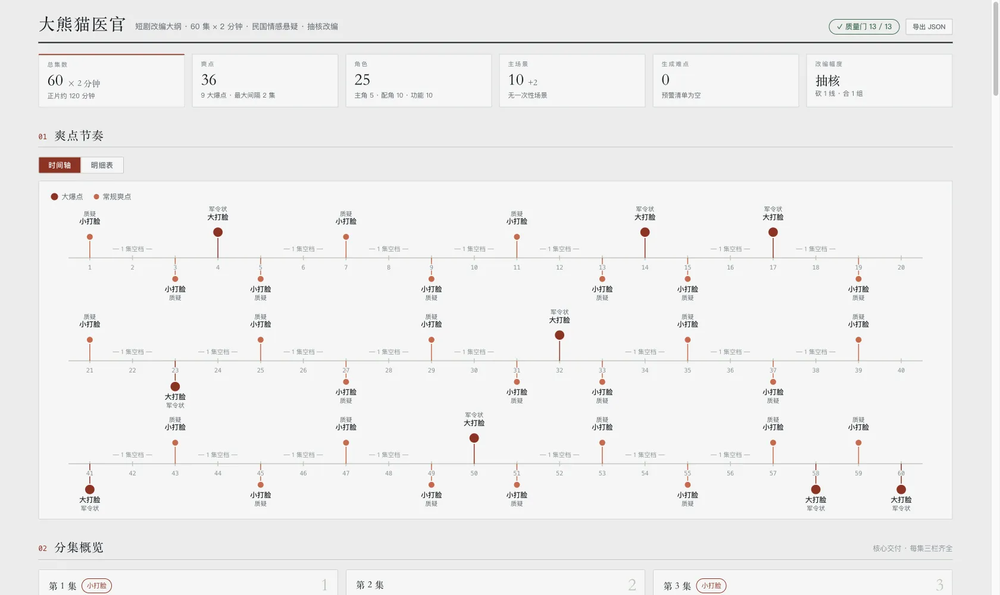

**中文** · [English](README.en.md)

# novel-outline

丢一本小说 + 目标参数进去，输出短剧改编大纲**五件套**：

- **改编说明** — 一句话核心 + 保留/砍掉/合并三张表 + 风险对策 + 决策结论句（`cutNote`「这意味着…」/ `mergeNote` 主角组入选理由），关键取舍附**原文逐字依据**
- **人物表** — 角色分档管理：主角组 ≤ 5、重要配角 ≤ 10、功能性角色 ≤ 10（占脸不占名，用称呼标签），每人带 **← 改动记录**（原著对应谁、合并了谁）
- **爽点表** — major/minor 分级、逐集落点，间隔 ≤ 3 集无真空区
- **分集梗概** — 每集三栏：梗概 +【钩子】+【悬念】，缺一栏视为未完成；叙述体，出现对白就是越界
- **资产清单** — **脚本自动汇总**，不让模型写：场景/角色的出现集与次数、一次性场景的复用方案、生成难点预警、**角色资产量折算**（主角组出全套设定图、重要配角出半身参考、功能性角色提示词直出）

产出 `outline.json` + Markdown + 一个双击就能开的 `outline-report.html`：



## 质量门：13 道，全是代码

这个 skill 的核心主张：**checklist 交给模型自觉是靠不住的**。所以每一道门都是 `validate` 里的确定性检查，不是给模型读的文字：

| 门 | 默认阈值 |
| --- | --- |
| 主角组（男女主 + 主反派） | 1–5 人 |
| 有名字的重要配角 | ≤ 10 人 |
| 功能性角色（医生、店员……占脸不占名） | ≤ 10 人 |
| 主场景上限 | **随集数动态**：4 + ⌈集数/10⌉，夹在 5–15（6 集 → 5，60 集 → 10，110 集起封顶 15） |
| 一次性场景有规避方案 | — |
| 爽点间隔无真空区 | ≤ 3 集 |
| 第 1 集有钩子 | — |
| 大爆点不压最后一集 | — |
| 每集三栏齐全（钩子/悬念必填） | — |
| 三人以上同框有拆解方案 | — |
| 生成难点进预警清单（雨戏/肢体接触/人群/手部特写） | 关键词扫描 |
| 引用完整：无失业角色、无空转场景、ID 都存在 | — |
| 梗概是叙述体，无引号对白 | — |

阈值可以按平台覆盖（`params.thresholds`），不用改代码。自测里每一道门都有**击穿用例**——证明它真的会拦，不是永远为真的假测试。

角色为什么分档而不是一刀切：一刀切混淆了「观众要记住谁」和「制作要维护多少张脸」。分档之后各管各的——主角组上限守的是戏份和记忆负担，配角和功能性角色的上限守的是 **AI 角色资产成本**（每一档的一致性投入完全不同）。无名背景人不进表、不追踪、不限量。功能性角色**没有人物弧是正常的**——医生就是来缝针的，`validate` 不会强求。

场景上限为什么放得比实景剧宽：这套阈值是给 **AI 短剧**定的——场景是生成的，没有搭景钱，实景时代「≤ 5 个景」的经济学不成立。上限守的只剩场景的**跨集一致性资产**和观众的空间认知，而观赏性直接吃场景多样性，所以随集数放宽到最多 15。

## 流程里最值钱的一条：先拍板再细化

骨架（砍线/合人/排爽点）必须先出**快版**给用户拍板——砍了哪条线、合了哪些人、大爆点在第几集——点头之后才允许写分集梗概。这一条是流程门不是口头约定：写分集前必须过 `validate --stage beats`，爽点间隔和 major 时机错了当场拦下。

分集本身也分批写，每批 ≤ 10 集，60 集一口气写后半段必崩。

## 报告长什么样

业内评审用的单页报告，页宽 1600，全部平铺可 Cmd+F：

- **KPI 带**：总集数 / 爽点 / 角色分档 / 主场景 / 生成难点 / 改编幅度，六张统计卡开门见山
- **爽点节奏**：图/表 tab——默认剧情时间轴（大爆点实心、常规浅色，**空档直接标在轴上**，超阈值变铁锈红，超过 20 集自动折行），切一下看明细表
- **分集概览**：三列卡片，默认只显示前三集，底部渐隐 + 展开按钮；每张带爽点胶囊章、钩子/悬念栏、场景/角色/预警标签
- **场景概览**：每场景一张卡——右上浅灰剧集编号、出现集微条、承载爽点、出场角色或复用方案
- **关键决策**：拍板过的三件事落进纸面——砍了哪条线（带「这意味着…」结论句）、合了哪些人（角色位统计和主角组名单**算出来**）、大爆点落在第几集（从爽点表自动列，首末带标记）
- **每集调度矩阵**：角色 + 场景同一张网格，一列竖着读就是那一集的需求单（要谁出场、在哪拍）
- **资产量折算**：角色三档、场景环境、生成难点各折算成备产工作量，全部自动汇总
- **质量门**：页眉徽章 + 未过时的病灶横幅 + 文末完整清单，✓/✗ 由脚本算好烘进页面
- **导出 JSON** 按钮：下载的就是 `outline.json` 原样，改完能直接喂回 `render` / `validate`
- 全部图形是内联 SVG/CSS，配色跑过可视化验证器，零外部依赖，离线双击能开

## 体检模式

已有大纲只想要诊断：

```bash
node scripts/novel-outline.mjs checkup outline.json    # 终端 ✓/✗
node scripts/novel-outline.mjs render outline.json --html > outline-report.html
```

质量门面板就是诊断书，未过的门不阻止渲染——要的就是把病灶摆出来。

## 长文本

80 万字塞不进上下文。`chunk` 按章节标题分卷（默认每卷 15 章），每卷并发出中间摘要再汇总；识别不出章节就按字数切。上限 60 卷，超了明确报 `truncated`，**不静默截断**。

关键取舍必须能指回原文（`keep[].evidence` 逐字片段）——**禁止凭书名脑补**。

## 命令行直接用

```bash
node scripts/novel-outline.mjs chunk book.txt /tmp/wk           # 按章分卷
node scripts/novel-outline.mjs validate outline.json            # 校验（--stage skeleton|beats|full）
node scripts/novel-outline.mjs checkup outline.json             # 只跑质量门
node scripts/novel-outline.mjs render outline.json --html       # 出报告
node scripts/novel-outline.mjs assets outline.json              # 资产清单 JSON
```

## 跟 novel-characters 的关系

分工：**novel-characters 管角色设定**（画像/形象提示词/音色/设定图），**novel-outline 管改编结构**（砍线/合人/排爽点/分集）。有 `cast.json` 就直接当人物原料喂进来，不用重拆原文。本 skill 不写台词、不做分镜、不出提示词。

## 文件

```
SKILL.md                 给 agent 读的工作流
scripts/
  novel-outline.mjs      chunk / validate / checkup / render / assets
  selftest.mjs           200 项断言，不调模型
references/
  schema.md              outline.json 结构 + 硬规则
  volume-pass.md         分卷摘要怎么写
  outline-pass.md        骨架：砍线/合人/排爽点 + 两轮拍板规则
  episode-pass.md        分集梗概：三栏、分批、叙述体
  report-style.md        报告的设计约定
examples/
  渡口-outline.json       《渡口》6 集微型大纲，全部质量门通过，也是自测夹具
assets/
  report.webp            报告截图
```

## 自测

```bash
node scripts/selftest.mjs
```

200 项断言，覆盖分卷 / 校验 / 质量门逐项击穿 / 资产汇总 / 渲染 / 导出。不调模型、不花额度、1 秒跑完。改完脚本先跑这个。

**只在 macOS + Node 24 上实测过。** 代码没有平台相关调用，Linux 和更低版本 Node 理论上没问题，但**没验过**。
